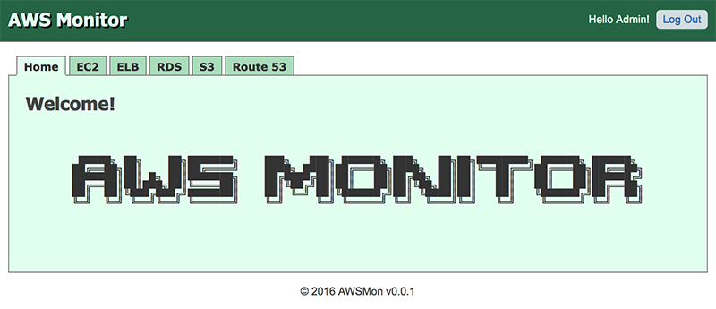

# devnoh-awsmon

```
 _______  _     _  _______    __   __  _______  __    _  ___   _______  _______  ______
|   _   || | _ | ||       |  |  |_|  ||       ||  |  | ||   | |       ||       ||    _ |
|  |_|  || || || ||  _____|  |       ||   _   ||   |_| ||   | |_     _||   _   ||   | ||
|       ||       || |_____   |       ||  | |  ||       ||   |   |   |  |  | |  ||   |_||_
|       ||       ||_____  |  |       ||  |_|  ||  _    ||   |   |   |  |  |_|  ||    __  |
|   _   ||   _   | _____| |  | ||_|| ||       || | |   ||   |   |   |  |       ||   |  | |
|__| |__||__| |__||_______|  |_|   |_||_______||_|  |__||___|   |___|  |_______||___|  |_|

```

## Solutions

* Java 8
* AWS Java SDK
* Spring Boot
* Spring Security
* Spring Data (JPA)
* Spring Web MVC
* Spring Test
* Thymeleaf
* JUnit
* Selenium
* Gradle
* Docker

## Build
```
$ gradle build
```

## Run
```
$ export AWS_CREDENTIAL_PROFILES_FILE=/path/to/aws/credentials

$ gradle bootRun

or

$ java -jar ./build/libs/devnoh-awsmon-0.0.1-SNAPSHOT.jar
```

## Build a Docker Image
```
$ gradle build buildDocker

$ docker images

$ docker login
$ docker push devnoh/awsmon

$ docker tag cc9dde7af295 devnoh/awsmon:0.0.1
$ docker push devnoh/awsmon:0.0.1
```

## Run a Docker Image

```
$ docker run -it --rm -p 8888:8080 -v /Users/devnoh:/path/to -e "AWS_CREDENTIAL_PROFILES_FILE=/path/to/.aws/credentials" --name myawsmon devnoh/awsmon
```

http://localhost:8888

## References

* http://docs.aws.amazon.com/sdk-for-java/v1/developer-guide/aws-sdk-java-dg.pdf

## Screenshot

